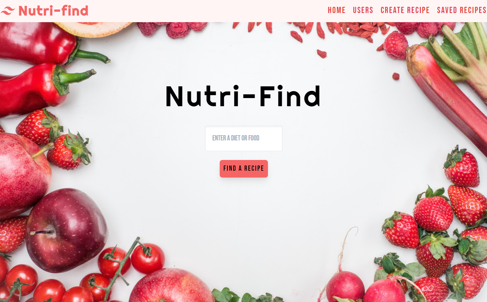

# Nutri-Find
A full-stack recipe/diet application Utilizing CRUD operations

# Preview

# Technologies Used
 • HTML
  
 • CSS
  
 • JAVASCRIPT/JQUERY
  
 • Tailwinds
  
 • Google Fonts
  
 • Animate.CSS
  
 • Sequelize
  
 • MySQL
  
 • Express/Handlebars
  
  

# 3rd Party API
 • EDAMAM 
 
 

# Authors
Stephen Webb - [Github](https://github.com/stevie2codes)
  
Christian Lance - [Github](https://github.com/Christianlance85)
  
Linsay McMahon - [Github](https://github.com/McMahon8900)
 

# USER STORY
"As Someone stuck in a diet rut, I need an app that can help me find new healthy options. I would also like to create recipes to save for later use.."